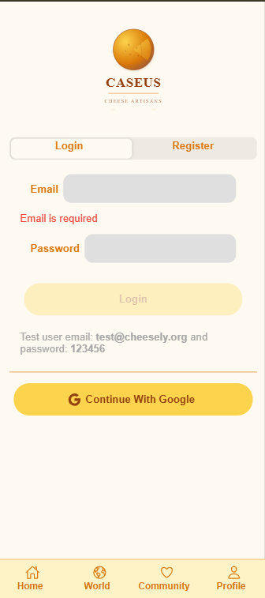
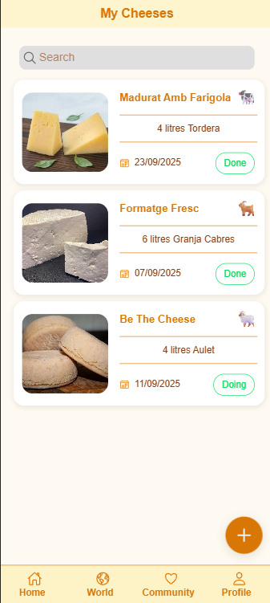
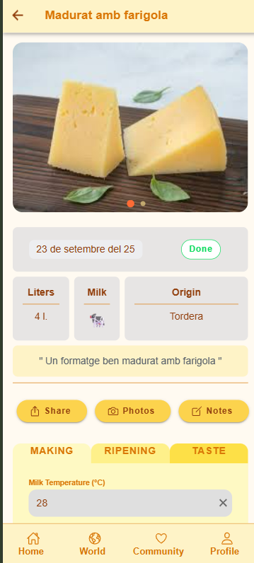
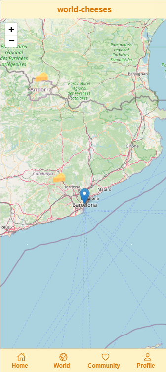
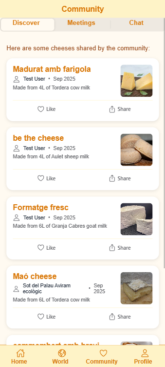
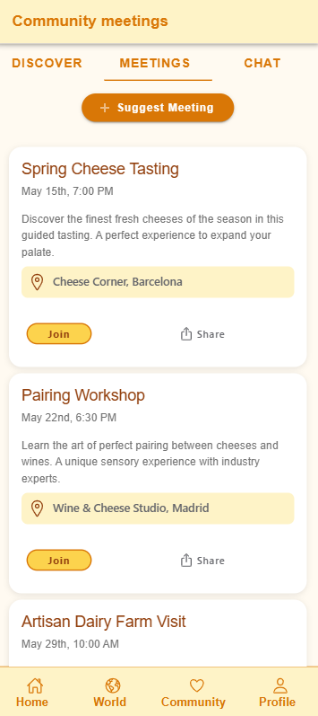
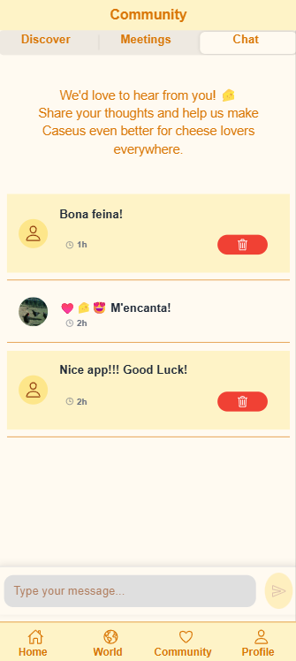
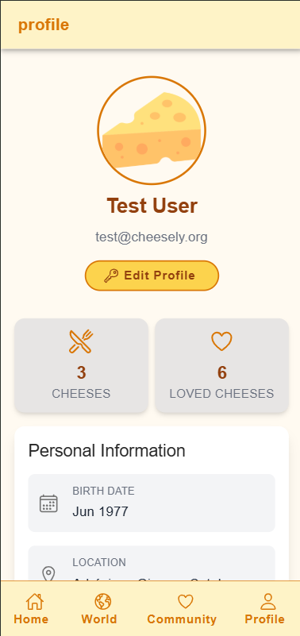

# 🧀 Caseus - Artisan Cheese Community

A comprehensive hybrid application built with **Ionic 8** and **Angular 20** for artisan cheese enthusiasts. Caseus enables users to document their cheese-making journey, explore global cheese varieties, and connect with a vibrant community of cheese makers and enthusiasts.

## 🚀 Live Demo

**🌐 Web App**: [https://cheese-29925.web.app/](https://cheese-29925.web.app/)

## 🧭 Overview

### Frontend

- **Framework**: Ionic 8 + Angular 20
- **Architecture**: Standalone Components (No NgModules)
- **Syntax**: Modern `@if`/`@for` control flow
- **Styling**: Tailwind CSS + Global SCSS utility classes
- **State**: RxJS Observables + Signals

### Backend & Services

- **Authentication**: Firebase Auth (Google OAuth + Email/Password)
- **Database**: MongoDB + Firebase Firestore
- **API**: Express.js REST API
- **Storage**: Firebase Storage for images
- **Push**: Firebase Cloud Messaging

### Mobile & Desktop

- **Capacitor**: Native mobile app capabilities
- **Platforms**: Web, iOS, Android
- **PWA**: Progressive Web App features

**🌐 Web App**: [https://cheese-29925.web.app/](https://cheese-29925.web.app/)

## ✨ Key Features

### 🏠 Personal Cheese Management

- **📊 Elaboration Tracking**: Complete cheese-making process documentation
- **🧪 Making Process**: Temperature, cultures, coagulation, and pressing details  
- **🧀 Ripening Management**: Temperature, humidity, turning, and washing schedules
- **👅 Taste Profiles**: Visual, aroma, texture, and flavor rating system
- **📸 Photo Documentation**: Multi-image capture with Capacitor Camera
- **📝 Notes System**: Time-stamped observations and process notes

### 🌍 Community & Discovery

- **👥 Community Feed**: Browse public cheeses from global cheese makers
- **❤️ Social Interactions**: Like and share functionality with native integration
- **� Loved Cheeses**: Dedicated page to view all user's liked cheeses
- **📅 Meeting Management**: Create and suggest community meetings and events
- **🎪 Event Creation**: Modal-based event creation with form validation
- **�👤 User Profiles**: Comprehensive user information and cheese portfolios with dynamic statistics
- **🗺️ World Cheese Map**: Interactive Leaflet map with global cheese varieties
- **🔍 Discovery**: Search and filter cheeses by type, origin, and characteristics
- **💬 Real-time Chat**: General community chat with message management and deletion
- **👥 User Presence**: See active community members in real-time

### 🔐 Authentication & Security

- **🔑 Firebase Auth**: Google OAuth and Email/Password authentication
- **👤 User Management**: Profile editing with real-time sync
- **🛡️ Security Rules**: Firestore security with user-based access control
- **📱 Cross-Platform**: Seamless experience across web, iOS, and Android

### 🔍 SEO & Performance

- **🏷️ Dynamic Meta Tags**: Automatic title, description, and keywords for each cheese
- **📊 Open Graph Support**: Rich social media sharing with previews
- **🐦 Twitter Cards**: Optimized Twitter sharing experience
- **🎯 Structured Data**: JSON-LD schema markup for Google rich snippets
- **🔗 Canonical URLs**: Proper URL canonicalization to avoid duplicate content
- **📱 Push Notifications**: Firebase Cloud Messaging with token management

## 📱 Application Features

### Core Features

- 📱 **Hybrid App**: Works on web, iOS and Android
- 🔐 **Authentication**: Google Auth & Email/Password with Firebase Auth
- 📸 **Photo Capture**: Document your cheeses with images using Capacitor Camera
- 🗺️ **World Map**: Interactive map with Leaflet to explore cheeses worldwide
- 📊 **Personal Management**: Complete cheese elaboration tracking and maturation

### Community Features (NEW! 🆕)

- 👥 **Community Feed**: Browse and discover cheeses shared by other users
- 🧀 **Cheese Details**: Comprehensive cheese information pages with Firebase Storage images
- 👤 **User Profiles**: Display user information with profile cards and displayname components
- � **Loved Cheeses Page**: Dedicated page showing all cheeses the user has liked
- 📊 **Dynamic Statistics**: Real-time counting of user's cheeses and liked cheeses in profile
- 📅 **Meeting System**: Complete meeting/event management system with creation modal
- 🎪 **Event Creation**: Interactive modal with form validation for suggesting new meetings
- 📱 **Responsive Design**: Breakpoint-based modals with drag-to-resize functionality
- �💬 **Social Interactions**: Like and share cheeses using native Capacitor Share
- 🔄 **Real-time Updates**: Live data synchronization with Firestore
- 💬 **Real-time Chat**: General community chat with Firebase Realtime Database
- 🗑️ **Message Management**: Users can delete their own messages with hover UI
- 👥 **User Presence**: Real-time user status and activity tracking
- 🎨 **Customized UI**: Amber-themed message styling for personal messages

### Technical Features

- 🎨 **Modern UI**: Global CSS classes system with Tailwind CSS integration
- 🏗️ **Standalone Components**: Angular 20 standalone architecture with modern @if/@for syntax
- 🔥 **Firebase Integration**: Complete Firebase ecosystem (Auth, Firestore, Storage, Cloud Messaging)
- 📱 **Native Features**: Camera, sharing, and filesystem access via Capacitor
- 🎯 **Optimized Performance**: Minimal SCSS with utility-first CSS approach
- 🔍 **SEO Optimized**: Dynamic meta tags, Open Graph, Twitter Cards, and structured data
- 📲 **Push Notifications**: Firebase Cloud Messaging with comprehensive error handling

## 📸 Screenshots

<!-- markdownlint-disable MD033 -->

|                                                                                        Home & Authentication                                                                                        |                                                                                        My Cheeses Collection                                                                                        |                                                                                        Cheese Detail & Elaboration                                                                                        |                                                                                        Community Feed                                                                                        |
| :-------------------------------------------------------------------------------------------------------------------------------------------------------------------------------------------------: | :-------------------------------------------------------------------------------------------------------------------------------------------------------------------------------------------------: | :-------------------------------------------------------------------------------------------------------------------------------------------------------------------------------------------------------: | :------------------------------------------------------------------------------------------------------------------------------------------------------------------------------------------: |
| <a href="src/assets/img/screenshots/screenshot1.png" target="_blank" rel="noopener noreferrer"></a> | <a href="src/assets/img/screenshots/screenshot2.png" target="_blank" rel="noopener noreferrer"></a> | <a href="src/assets/img/screenshots/screenshot3.png" target="_blank" rel="noopener noreferrer"></a> | <a href="src/assets/img/screenshots/screenshot4.png" target="_blank" rel="noopener noreferrer"></a> |

|                                                                                        Community Discover                                                                                        |                                                                                        Meetings & Events                                                                                        |                                                                                        Community Chat                                                                                        |                                                                                        User Profile                                                                                        |
| :----------------------------------------------------------------------------------------------------------------------------------------------------------------------------------------------: | :---------------------------------------------------------------------------------------------------------------------------------------------------------------------------------------------: | :------------------------------------------------------------------------------------------------------------------------------------------------------------------------------------------: | :----------------------------------------------------------------------------------------------------------------------------------------------------------------------------------------: |
| <a href="src/assets/img/screenshots/screenshot5.png" target="_blank" rel="noopener noreferrer"></a> | <a href="src/assets/img/screenshots/screenshot6.png" target="_blank" rel="noopener noreferrer"></a> | <a href="src/assets/img/screenshots/screenshot7.png" target="_blank" rel="noopener noreferrer"></a> | <a href="src/assets/img/screenshots/screenshot8.png" target="_blank" rel="noopener noreferrer"></a> |

<!-- markdownlint-enable MD033 -->

*Screenshots showcasing the main features: authentication, personal cheese management, community interactions, real-time chat, meeting system, user profiles, and loved cheeses collection.*

## 🛠️ Technology Stack

### Frontend (Stack)

- **Framework**: Ionic 8 + Angular 20
- **Architecture**: Standalone Components (No NgModules)
- **Syntax**: Modern `@if`/`@for` control flow
- **Styling**: Tailwind CSS + Global SCSS utility classes
- **State**: RxJS Observables + Signals

### Backend & Services (Stack)

- **Database**: Firebase Firestore (NoSQL) and MongoDB via ExpressJS APi Rest
- **Real-time**: Firebase Realtime Database for chat messaging
- **Authentication**: Firebase Auth with multi-provider support
- **Storage**: Firebase Storage + CDN
- **Hosting**: Firebase Hosting
- **Build**: Vite + Angular CLI

### Mobile & Native

- **Platform**: Capacitor 6
- **Camera**: `@capacitor/camera`
- **Sharing**: `@capacitor/share`
- **Storage**: `@capacitor/filesystem`
- **Network**: Connection status monitoring

## 📁 Project Architecture

```text
ionic-cheese/
├── 📁 src/
│   ├── 📁 app/
│   │   ├── 📄 app.component.ts          # Root component
│   │   ├── 📄 app.routes.ts             # Application routing
│   │   │
│   │   ├── 📁 components/               # Reusable UI components
│   │   │   ├── 📁 community/
│   │   │   │   ├── 📁 community-cheese-card/     # Community cheese cards
│   │   │   │   ├── 📁 discover-tab/              # Discovery interface
│   │   │   │   ├── 📁 chat-tab/                  # Real-time community chat
│   │   │   │   ├── 📁 meetings-tab/              # Community meetings
│   │   │   │   └── 📁 create-meeting-modal/      # Meeting creation modal
│   │   │   │
│   │   │   ├── 📁 my-cheeses/           # Personal cheese management
│   │   │   │   ├── 📁 cheese-card/               # Personal cheese cards
│   │   │   │   ├── 📁 cheese-detail/             # Detailed cheese view
│   │   │   │   ├── 📁 cheese-detail-images/      # Image gallery
│   │   │   │   ├── 📁 cheese-elaboration/        # Elaboration wizard
│   │   │   │   ├── 📁 cheese-elaboration-making/ # Making process
│   │   │   │   ├── 📁 cheese-elaboration-ripening/ # Ripening process
│   │   │   │   ├── 📁 cheese-elaboration-taste/  # Taste evaluation
│   │   │   │   ├── 📁 cheese-photo-capture/      # Camera integration
│   │   │   │   ├── 📁 ico-cheese-status/         # Status icons
│   │   │   │   └── 📁 ico-milk-type/             # Milk type icons
│   │   │   │
│   │   │   ├── 📁 user-profile-card/    # User profile display
│   │   │   ├── 📁 user-displayname/     # Compact user info
│   │   │   ├── 📁 login/                # Authentication forms
│   │   │   ├── 📁 register/             # User registration
│   │   │   ├── 📁 menu/                 # Navigation menu
│   │   │   ├── 📁 add-note-modal/       # Note creation modal
│   │   │   ├── 📁 edit-profile-modal/   # Profile editing
│   │   │   ├── 📁 connection-status/    # Network status
│   │   │   └── 📁 world-cheeses-map/    # Interactive map
│   │   │
│   │   ├── 📁 pages/                    # Main application pages
│   │   │   ├── 📁 home/                 # Dashboard/Home page
│   │   │   ├── 📁 my-cheeses/           # Personal cheese collection
│   │   │   ├── 📁 community/            # Community features
│   │   │   │   └── 📁 community-cheese-detail/ # Public cheese details
│   │   │   ├── 📁 loved-cheeses/        # User's liked cheeses collection
│   │   │   ├── 📁 world-cheeses/        # Global cheese database
│   │   │   └── 📁 profile/              # User profile management
│   │   │
│   │   ├── 📁 services/                 # Business logic & API
│   │   │   ├── 📄 auth.service.ts       # Authentication logic
│   │   │   ├── 📄 cheese.service.ts     # Cheese CRUD operations
│   │   │   ├── 📄 user.service.ts       # User management
│   │   │   ├── 📄 world-cheeses.service.ts # Global cheese data
│   │   │   ├── 📄 firebase-storage.service.ts # File uploads
│   │   │   ├── 📄 firestore.service.ts  # Database operations
│   │   │   ├── 📄 chat.service.ts       # Real-time chat & messaging
│   │   │   ├── 📄 network.service.ts    # Connection monitoring
│   │   │   ├── 📄 push.service.ts       # Push notifications
│   │   │   ├── 📄 seo.service.ts        # SEO meta tags & structured data
│   │   │   └── 📄 focus-manager.service.ts # UI focus management
│   │   │
│   │   ├── 📁 interfaces/               # TypeScript type definitions
│   │   │   ├── 📄 cheese.ts             # Cheese data models
│   │   │   ├── 📄 user.ts               # User data models
│   │   │   ├── 📄 world-cheese.ts       # Global cheese types
│   │   │   └── 📄 chat.ts               # Chat & messaging models
│   │   │
│   │   └── 📁 guards/                   # Route protection
│   │
│   ├── 📁 assets/                       # Static resources
│   │   ├── 📁 icon/                     # App icons
│   │   └── 📁 img/                      # Images and graphics
│   │
│   ├── 📁 environments/                 # Environment configuration
│   │   ├── 📄 environment.ts            # Development config
│   │   └── 📄 environment.prod.ts       # Production config
│   │
│   ├── 📁 theme/                        # Ionic theming
│   │   └── 📄 variables.scss            # CSS variables
│   │
│   ├── 📄 global.scss                   # Global styles & utility classes
│   ├── 📄 tailwind.css                  # Tailwind CSS imports
│   └── 📄 main.ts                       # Application bootstrap
│
├── 📄 capacitor.config.ts               # Capacitor configuration
├── 📄 ionic.config.json                 # Ionic CLI configuration
├── 📄 tailwind.config.js                # Tailwind CSS configuration
├── 📄 angular.json                      # Angular CLI configuration
├── 📄 package.json                      # Dependencies & scripts
└── 📄 firebase.json                     # Firebase deployment config
```

## �️ Architecture Highlights

### Modern Angular Patterns

- **Standalone Components**: No NgModules, direct imports
- **Control Flow**: `@if`, `@for`, `@switch` syntax
- **Dependency Injection**: `inject()` function pattern
- **Reactive Forms**: Type-safe form management
- **Signals**: Modern reactivity (where applicable)

### Firebase Integration

- **Authentication**: Multi-provider auth with security rules
- **Firestore**: Document-based database with real-time sync
- **Realtime Database**: Chat messaging with live updates
- **Storage**: CDN-optimized image delivery
- **Security**: Row-level security and data validation

### Real-time Chat System 💬

#### Chat Features

- **🏠 General Chat Room**: Simplified single-room chat for community demo
- **⚡ Real-time Messaging**: Instant message delivery with Firebase Realtime Database
- **🗑️ Message Deletion**: Users can delete their own messages with hover-based UI
- **🎨 Personalized UI**: Amber-themed styling for user's own messages
- **👤 User Authentication**: Integrated with Firebase Auth for secure messaging
- **📱 Responsive Design**: Mobile-optimized chat interface with Ionic components

#### Technical Implementation

```typescript
// Chat Service Integration
private chatService = inject(ChatService);
private authService = inject(AuthService);

// Send message
async sendMessage() {
  if (this.newMessage.trim()) {
    await this.chatService.sendMessage({
      message: this.newMessage.trim(),
      roomId: 'general-chat',
      userId: this.authService.currentUser.uid,
      userName: this.authService.currentUser.displayName,
      userAvatar: this.authService.currentUser.photoURL,
      timestamp: Date.now()
    });
    this.newMessage = '';
  }
}

// Delete own message
async deleteMessage(message: ChatMessage) {
  if (this.isOwnMessage(message) && message.id) {
    await this.chatService.deleteMessage(message.id, message.roomId);
  }
}
```

#### Chat Interfaces

- **ChatMessage**: Message data structure with user info and timestamps
- **ChatRoom**: Room configuration and metadata
- **UserPresence**: Real-time user activity tracking
- **MessageStatus**: Delivery and read status management

### Styling Strategy

- **Global Utilities**: Centralized CSS classes in `global.scss`
- **Tailwind Integration**: Utility-first CSS with Ionic compatibility
- **CSS Variables**: Consistent theming across components
- **Component Isolation**: Scoped styles where needed

## � SEO Implementation

### Features

- **🎯 Dynamic Meta Tags**: Automatic title, description, and keywords generation
- **📊 Open Graph**: Rich social media previews for Facebook, LinkedIn, etc.
- **🐦 Twitter Cards**: Optimized Twitter sharing with image previews
- **📱 JSON-LD Structured Data**: Schema.org markup for Google rich snippets
- **🔗 Canonical URLs**: Proper URL canonicalization
- **🔄 Real-time Updates**: SEO data updates automatically when content loads

### SEO Service Usage

```typescript
// Inject the SEO service in your component
private seoService = inject(SeoService);

// Update meta tags for cheese details
this.seoService.updateCheeseMeta({
  _id: cheese._id,
  name: cheese.name,
  description: cheese.description,
  milkType: cheese.milkType,
  milkOrigin: cheese.milkOrigin,
  imageUrl: cheese.imageUrl,
  userId: cheese.userId,
  createdAt: cheese.createdAt
});

// Add structured data for rich snippets
this.seoService.addCheeseStructuredData(cheese);

// Update community page meta tags
this.seoService.updateCommunityMeta();

// Reset to default meta tags
this.seoService.resetToDefault();
```

### Structured Data Output

The SEO service generates JSON-LD structured data like:

```json
{
  "@context": "https://schema.org/",
  "@type": "Food",
  "name": "Manchego Artesà",
  "description": "Formatge de llet d'ovella amb 6 mesos de maduració",
  "image": "https://firebasestorage.googleapis.com/...",
  "category": "Cheese",
  "ingredient": [{
    "@type": "Ingredient",
    "name": "Llet d'ovella"
  }],
  "publisher": {
    "@type": "Organization",
    "name": "Caseus"
  }
}
```

## �🚀 Getting Started

### Prerequisites

```bash
# Required versions
Node.js >= 20.19.0
npm >= 9.0.0
```

### Installation

```bash
# Clone the repository
git clone https://github.com/GeorginaTS/ionic-cheese.git
cd ionic-cheese

# Install dependencies
npm install

# Install Ionic CLI globally (if not installed)
npm install -g @ionic/cli
```

### Firebase Setup

1. Create a Firebase project at [Firebase Console](https://console.firebase.google.com/)
2. Enable Authentication, Firestore, and Storage
3. Copy your config to `src/environments/environment.ts`:

```typescript
export const environment = {
  production: false,
  firebase: {
    apiKey: "your-api-key",
    authDomain: "your-project.firebaseapp.com",
    projectId: "your-project-id",
    storageBucket: "your-project.appspot.com",
    messagingSenderId: "123456789",
    appId: "your-app-id"
  }
};
```

### Development Server

```bash
# Start development server
npm start
# or
ionic serve

# The app will open at http://localhost:8100
```

### Building for Production

```bash
# Build the app
npm run build

# Deploy to Firebase
firebase deploy
```

## 📱 Mobile Development

### iOS Development

```bash
# Add iOS platform
ionic capacitor add ios

# Build and sync
ionic capacitor build ios

# Open in Xcode
ionic capacitor open ios
```

### Android Development

```bash
# Add Android platform
ionic capacitor add android

# Build and sync
ionic capacitor build android

# Open in Android Studio
ionic capacitor open android
```

## 🧪 Testing

```bash
# Run unit tests
npm test

# Run tests with coverage
ng test --code-coverage

# Run linting
ng lint
```

## 📊 Performance Features

### Optimization Strategies

- **Lazy Loading**: Route-based code splitting
- **OnPush Strategy**: Optimized change detection
- **Global CSS**: Reduced bundle size with utility classes
- **Image Optimization**: WebP support with Firebase Storage
- **Service Workers**: Offline functionality

## 🔧 Configuration

### Environment Variables

- `environment.ts` - Development configuration
- `environment.prod.ts` - Production configuration
- Firebase configuration
- API endpoints and keys

### Capacitor Configuration

- Platform-specific settings in `capacitor.config.ts`
- Plugin configurations
- Native permissions and capabilities

## 🤝 Contributing

We welcome contributions! Please follow these steps:

1. **Fork** the repository
2. **Create** a feature branch (`git checkout -b feature/amazing-feature`)
3. **Follow** the coding standards (Angular Style Guide)
4. **Write** tests for new functionality
5. **Commit** with conventional commits (`feat:`, `fix:`, `docs:`)
6. **Push** to your branch (`git push origin feature/amazing-feature`)
7. **Open** a Pull Request

### Development Guidelines

- Use Angular standalone components
- Follow the `@if`/`@for` control flow syntax
- Write comprehensive unit tests
- Use TypeScript strict mode
- Follow the established folder structure

## 📄 License

This project is licensed under the MIT License. See [LICENSE](LICENSE) for details.

## 👨‍💻 Author

**Georgina TS** - [GitHub](https://github.com/GeorginaTS)

## 🙏 Acknowledgments

- **Ionic Team** - Amazing hybrid framework
- **Angular Team** - Powerful web framework  
- **Firebase** - Excellent backend-as-a-service
- **Tailwind CSS** - Utility-first styling
- **Leaflet** - Interactive mapping solution

---

> **Made with ♥️ for the artisan cheese community**
